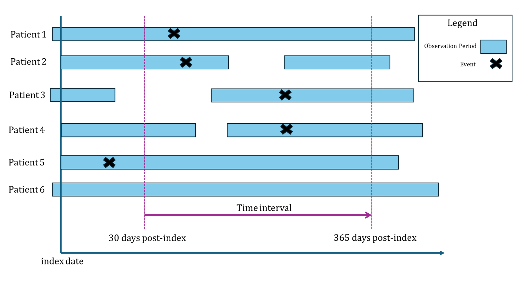
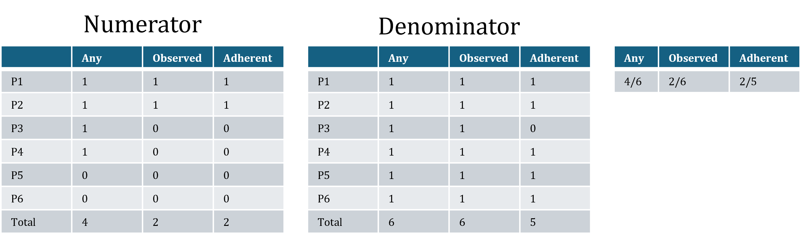
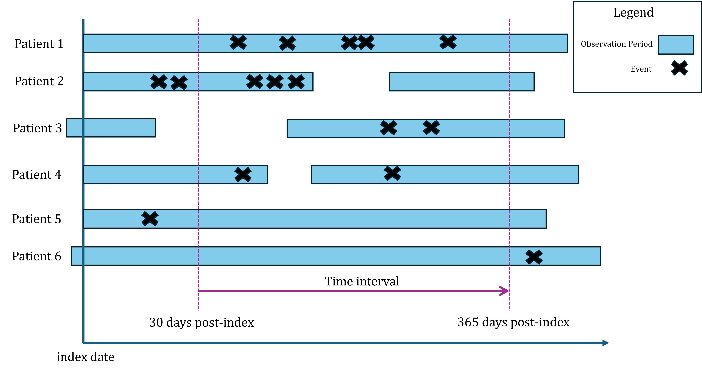
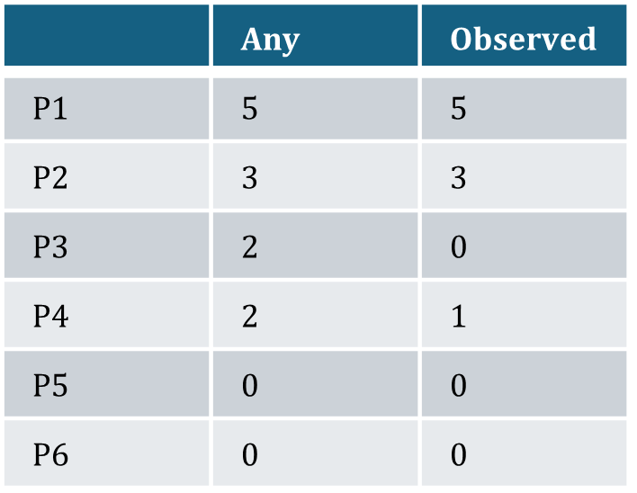

# ClinicalCharacteristics Statistics

## Statistics that use the Any, Observed, or Adherent methods to count patients

`PresenceStat`is a set of three functions that calculates the count and percentage of patients in a cohort that had at least one occurrence of an event during a specified time interval. The event could be any observable record in the database like a condition occurrence, drug exposure, or procedure. There are three different methods to determine whether an event should be counted and to calculate the percentage of patients exhibiting the event: Any (AnyPresenceStat), Observed (ObservedPresenceStat), or Adherent (AdherentPresenceStat). The next section defines each of these methods.

`CountCtsStat` is a pair of functions that counts the number of times each patient experiences a particular event during an interval, then returns descriptive statistics (mean, standard deviation, min value, 10th, 25th, median, 75th, 90th percentiles, and max value) for the distribution of the cohort. The two methods to determine whether an event should be counted are Any (AnyCountCtsStat) and Observed (ObservedCountCtsStat).

`CountBreaksStat`is a pair of functions that, much like \`CountCtsStat, counts the number of times each patient experiences a particular event during an interval. Instead of returning data about the distribution, it converts the distribution into user-defined breaks/bins and returns the count of patients that fall into each bin. For example, a user could break the distribution into bins of people experiencing the event 1, 2, 3, or 4+ times. The two methods to determine whether an event should be counted are Any (AnyCountBreaksStat) and Observed (ObservedCountBreaksStat).

### PresenceStat: How to calculate Any, Observed, and Adherent

The diagram below represents a cohort of 6 patients. It demonstrates the differences between “any”, “observed” and “adherent, the three possible methods to calculate the percentage of patients in a cohort that exhibit an event during a specified time interval. Each patient has an index date (the date they entered the cohort) and one or more observation periods. The black X represents an occurrence of the event.

{width="80%"}

#### Any

-   `AnyPresenceStat`

Any is the easiest to count. If the event occurs during the time interval, then we count the patient. The percentage is calculated by dividing the count of patients exhibiting the event by the total number of patients in the cohort. In the diagram, patients 1 – 4 have the event occur during the interval, so the count of “any” is 4. Patient 5 does not count because their event occurs before the start of the time interval, and patient 6 does not exhibit the event at all. The percentage calculation is 4 / 6 = .66.

#### Observed

-   `ObservedPresenceStat`

An observed event only counts if it is within a patient’s first, unbroken observation period during the time interval. In other words, a patient’s observation period must overlap and extend beyond the start of the time interval, and the event must occur within that unbroken observation period during the interval.

In the diagram, only patient 1 and 2 are counted as “observed” because their events occur within the first unbroken observation period within the time interval. Patients 3 and 4 are not counted even though they have an event during the time interval because the event occurs during an observation period that did not overlap with the start of the time interval. Patient 5 would not count because their event occurs outside of the time interval. The percentage of patients with the observed event is 2/6 = .33

#### Adherent

-   `AdherentPresenceStat`

To calculate the percentage of patients with adherent, the numerator is counted the same as the patients with observed but the denominator is counted differently. For “any” and “observed”, the denominator is the total count of patients in the cohort. For adherent, the patient is only counted for the denominator if their initial unbroken observation period overlaps with the beginning of the time interval. In the diagram, patient 3 does not have an observation period that overlaps the start of the time interval, so we do not count them. The other five patients have observation periods that overlap with the start of the interval, so the denominator of the percentage calculation is 5. Therefore, the percentage of adherent patients is 2/5 = .4

{width="90%"}

### CountCtsStat: How to calculate Any and Observed

`CountCtsStat` counts the number of times each patient experiences a particular event during an interval, then returns descriptive statistics (mean, standard deviation, min value, 10th, 25th, median, 75th, 90th percentiles, and max value) for the distribution of the cohort. **(Note: The methods to determine whether an event should be counted are the same as for Presence)**. There is no adherent method because we are not calculating percentages of the total cohort that experience the event.

{width="80%"}

#### Any

-   `AnyCountCtsStat`

If the event occurs during the time interval, then we count the patient. In the diagram, Patient 1 has five events that occur within the interval, Patient 2 has three events, and Patients 3 and 4 each have two.

#### Observed

-   `ObservedCountCtsStat`

Patients 1 and 2 have, respectively, five and three events that occur within the first unbroken observation period within the time interval. Both events for Patient 3 occur during an observation period that does not overlap with the beginning of the interval, so neither would be counted using the observed method. Patient 4 has one event that occurs within the observation period that overlaps the beginning of the interval.

{width="50%"}

### CountBreaksStat: How to calculate Any and Observed

`CountBreaksStat` counts the number of times each patient experiences a particular event during an interval and converts the distribution into user-defined breaks/bins and returns the count of patients that fall into each bin.

**(Note: To determine whether an event should be counted, `CountBreaksStat` uses the any and observed methods in the same way as`CountCtsStat`).**

-   `AnyCountBreaksStat`

-   `ObservedCountBreaksStat`

## Other Statistics

### Time To First

`timeToFirst` determines the distribution of the number of days between the interval start and the occurrence of each patient’s first event. It returns descriptive statistics (mean, standard deviation, min value, 10th, 25th, median, 75th, 90th percentiles, max value) for the distribution across the cohort. Any occurrence of the event during the interval is valid.

## Choosing between Cohort Era and Start Date
